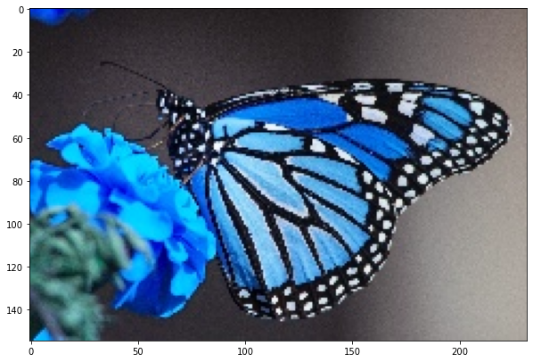
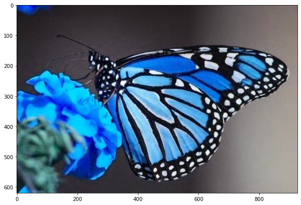

```python
import cv2
from cv2 import dnn_superres
from matplotlib import pyplot as plt
```

#### Create an SR object


```python
sr = dnn_superres.DnnSuperResImpl_create()
```

#### Read image


```python
image = cv2.imread('./input.png')
cv2.imshow("k",image)
cv2.waitKey(0)
cv2.destroyAllWindows()
```


```python
plt.figure(figsize=(10,10))
plt.imshow(image)
```


    <matplotlib.image.AxesImage at 0x1da868ffa30>


    

    


```python
path = "EDSR_x4.pb"
```


```python
sr.readModel(path)
```


```python
# Set the desired model and scale to get correct pre- and post-processing
sr.setModel("edsr", 4)

# Upscale the image
result = sr.upsample(image)

# Save the image
cv2.imwrite("./upscaled.png", result)

```


    True


```python
plt.figure(figsize=(10,10))
plt.imshow(result)
```


    <matplotlib.image.AxesImage at 0x1da86bc7070>


    

    


```python

```
